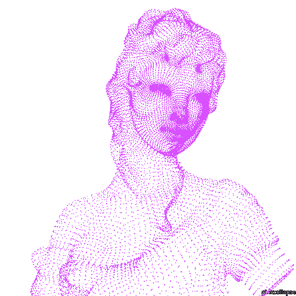

<div align="center">

# `phz9ra@github`

### Software Developer • IT • Systems Development


</div>

---

<table>
<tr>
<td width="44%" align="center">



</td>

<td width="56%">

```txt
phz9ra@github
──────────────────────────────────────

Hi, I'm Pedro Henrique 👋

Role:   IT Professional & Software Developer
Study:  Systems Development @ SENAI
Focus:  Web Development • Backend • Systems

Currently:
> building real-world applications
> improving backend & web development skills
> working with IT infrastructure and systems

Contact:
Email:   montani.dev@gmail.com
GitHub:  github.com/phz9ra
```

</td>
</tr>
</table>

---

## `> technologies`

<div align="center">

### Front-end


### Back-end & Languages


### Database & Tools


</div>

---

## `> about_me`

```yaml
name: Pedro Henrique
username: phz9ra

area:
  - Software Development
  - Information Technology
  - Web Development
  - Backend Development

education:
  - Systems Development @ SENAI

interests:
  - building useful software
  - backend architecture
  - web applications
  - systems and infrastructure
  - automation
```

---

## `> featured_projects`

<table>
<tr>
<td width="50%" valign="top">

### Revestone
Corporate web project focused on responsive design, product presentation, catalogs and business-oriented features.

**Stack:** Next.js • React • JavaScript

</td>
<td width="50%" valign="top">

### GG Panel
Gaming management platform for teams, players and tournaments.

**Stack:** React • Node.js • Express • SQLite

</td>
</tr>

<tr>
<td width="50%" valign="top">

### Alumigames
Competitive gaming platform concept focused on CS2 matches, server integration and event operations.

**Focus:** Web • Backend • Game Server Integration

</td>
<td width="50%" valign="top">

### Sonora
Music application with playlist and recommendation-oriented features.

**Focus:** Media • Recommendations • User Experience

</td>
</tr>
</table>

---

## `> github_activity`

<div align="center">


</div>

---

## `> profile_views`

<div align="center">


</div>

---

## `> contact`

<div align="center">

[](mailto:montani.dev@gmail.com)
[](https://github.com/phz9ra)

</div>

<br>

<div align="center">

`code • learn • build • repeat`

</div>
